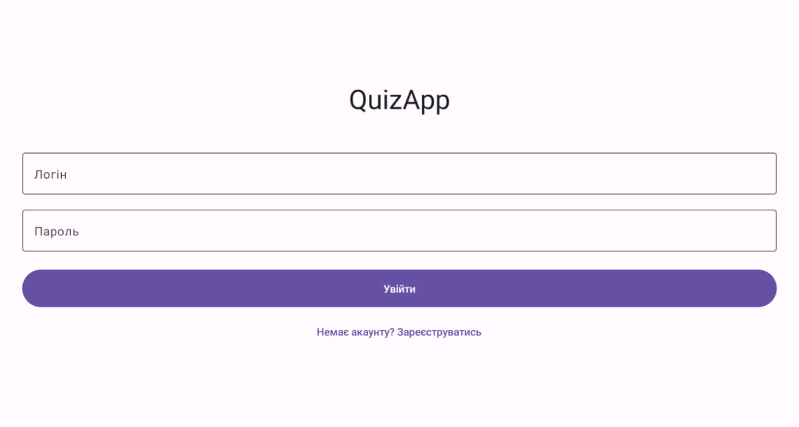
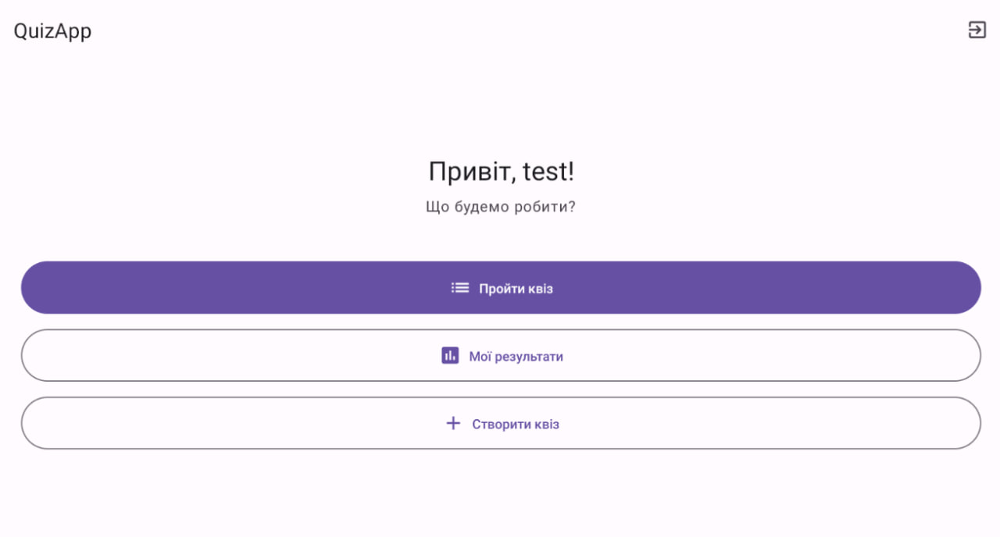
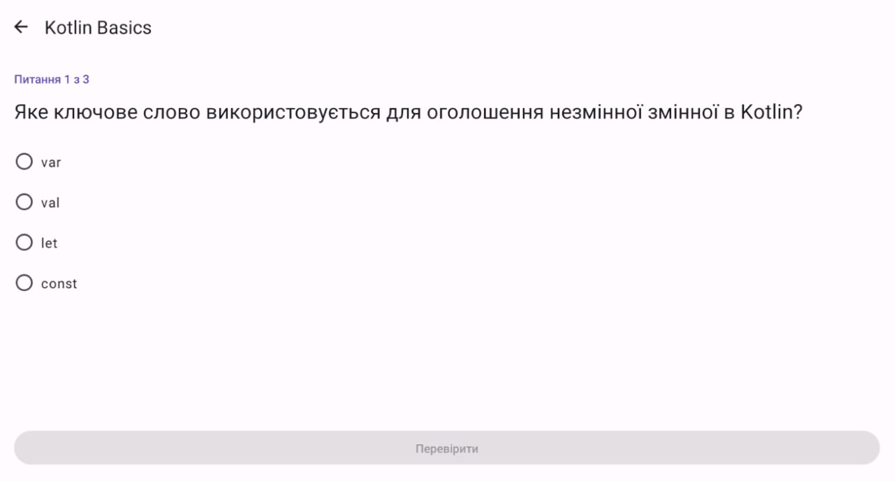
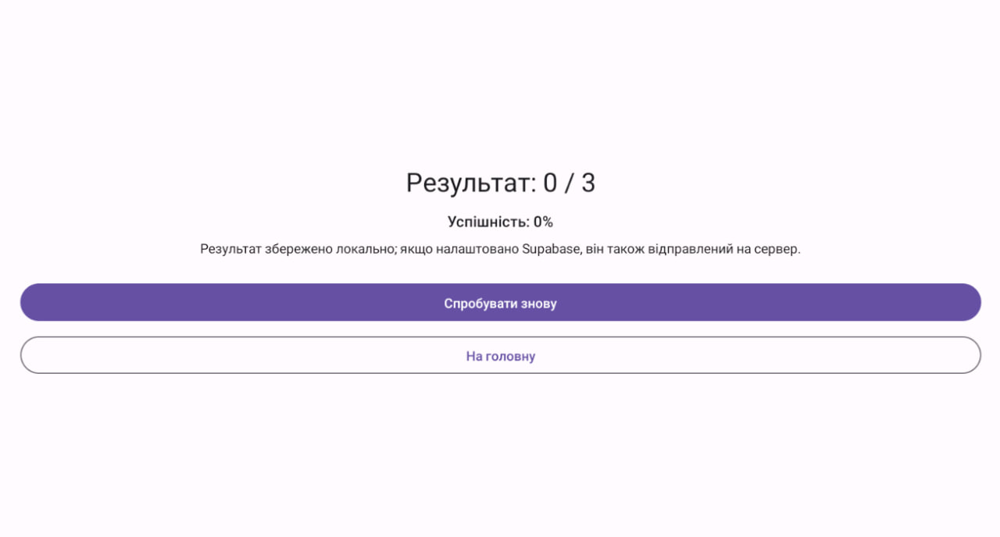
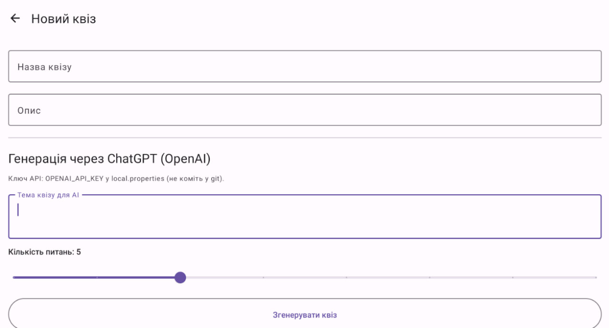
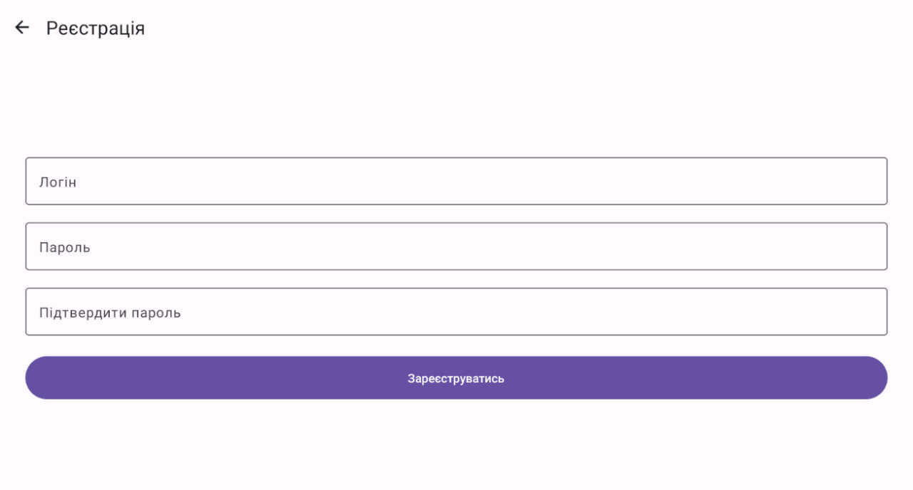
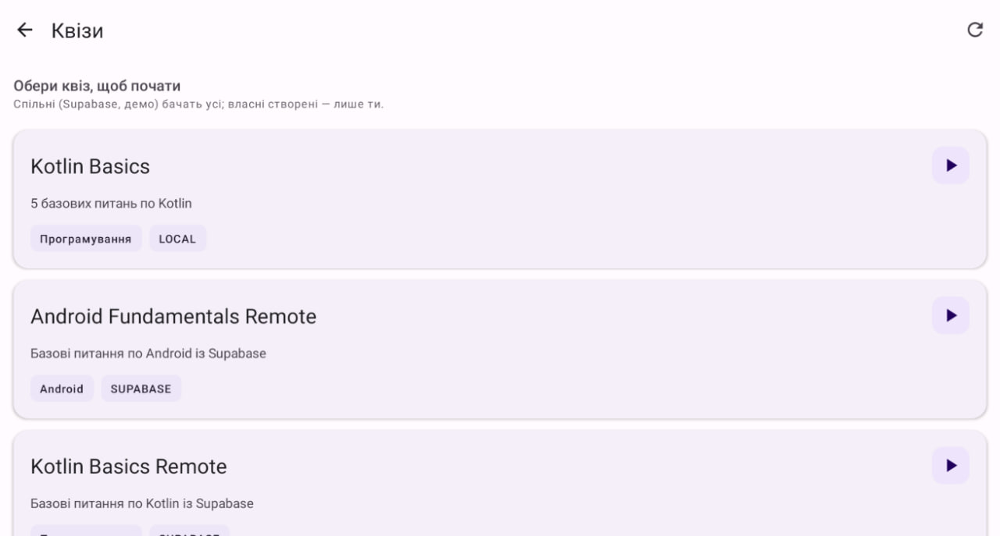
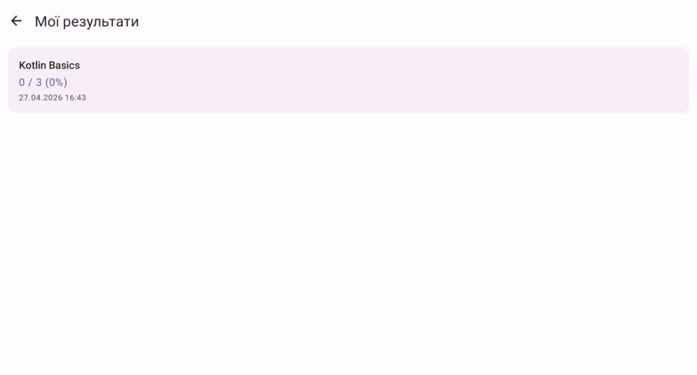

# Quiz App

Мобільний Android-додаток для проходження квізів, створення власних тестів та збереження історії результатів.  
Підтримує локальні квізи, синхронізацію з Supabase та AI-генерацію питань через OpenAI.

## Функціональність

- Реєстрація та вхід користувача
- Список доступних квізів (локальні та завантажені)
- Проходження квізу з підрахунком результату
- Екран результатів та історія спроб
- Створення власного квізу вручну
- AI-генерація квізу за темою

## Технологічний стек

- **Мова:** Kotlin
- **UI:** Jetpack Compose, Material 3
- **Архітектура:** MVVM (ViewModel + Repository)
- **Локальне сховище:** Room
- **Мережа:** OkHttp
- **Backend:** Supabase REST API
- **Асинхронність:** Kotlin Coroutines + Flow
- **Навігація:** Navigation Compose

## Запуск проєкту

1. Відкрий проєкт в Android Studio.
2. Перевір, що у `local.properties` є:
   - `OPENAI_API_KEY=...`
   - `SUPABASE_URL=...`
   - `SUPABASE_ANON_KEY=...`
3. Запусти застосунок через IDE або збери APK командою:

```bash
.\gradlew.bat assembleDebug
```

APK буде в `app/build/outputs/apk/debug/app-debug.apk`.

## Скріншоти програми

### Login


### Home


### Quiz Play


### Results


### AI Generation


### Register


### Quiz List


### History
